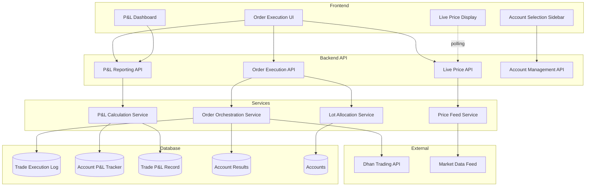
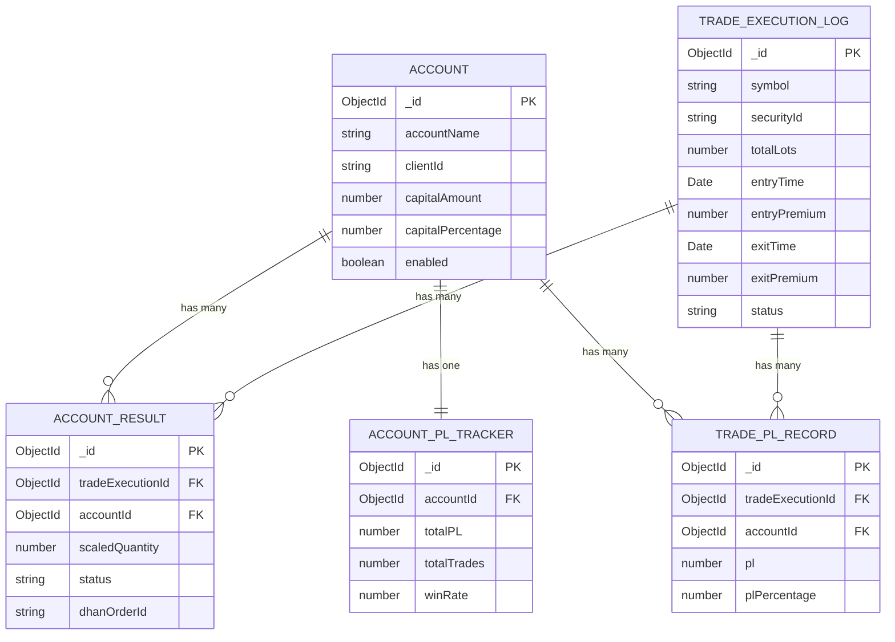

# Design Document: Intelligent Nifty 50 Order Execution

## Overview

The Intelligent Nifty 50 Order Execution System is a specialized trading feature that enables multi-account order execution for Nifty 50 options with intelligent capital-based lot allocation. The system provides real-time position tracking, synchronized exit capabilities, and comprehensive profit/loss reporting across multiple dimensions (per-account, per-trade, and aggregate).

### Key Capabilities

- **Instrument-Specific Trading**: Restricted to Nifty 50 options only to prevent instrument selection errors
- **Multi-Account Execution**: Concurrent order placement across multiple Dhan trading accounts
- **Intelligent Lot Allocation**: Automatic lot distribution based on available capital and configured capital percentage
- **Real-Time Price Tracking**: Live price updates with sub-second latency for active positions
- **Synchronized Exit**: Single-action exit across all accounts with active positions
- **Comprehensive P&L Tracking**: Multi-dimensional profit/loss reporting at account, trade, and aggregate levels
- **Performance Optimized**: Concurrent API calls and efficient data structures for sub-2-second execution

### Design Philosophy

This design follows a separation-of-concerns architecture with distinct layers for:
1. **API Layer**: RESTful endpoints for order execution and data retrieval
2. **Service Layer**: Business logic for lot allocation, order orchestration, and P&L calculation
3. **Data Layer**: Separate database tables for different data concerns with proper indexing
4. **Frontend Layer**: React components with real-time updates via polling or WebSocket

## Architecture

### System Components



### Data Flow

#### Order Execution Flow

1. User selects accounts from sidebar
2. User selects Nifty 50 option and specifies total lots
3. Frontend fetches current premium from Price Feed Service
4. Frontend sends execution request to Order Execution API
5. Lot Allocation Service calculates lot distribution per account
6. Order Orchestration Service places orders concurrently via Dhan API
7. System creates Trade_Execution_Log entry
8. System creates Account_Result entries for each account
9. Frontend displays execution status

#### Live Price Update Flow

1. Price Feed Service subscribes to market data for active positions
2. Market data updates received at 1-second intervals
3. Frontend polls Price API every 1 second
4. P&L Calculation Service computes current P&L based on live prices
5. Frontend updates UI with new prices and P&L values

#### Exit Execution Flow

1. User clicks synchronized exit button
2. Frontend sends exit request to Order Execution API
3. Order Orchestration Service retrieves all active positions
4. Service places SELL orders concurrently for all accounts
5. System updates Trade_Execution_Log with exit details
6. P&L Calculation Service computes final P&L per account and per trade
7. System creates Trade_P&L_Record entries
8. System updates Account_P&L_Tracker entries
9. Frontend displays exit status and final P&L

## Components and Interfaces

### Backend Components

#### 1. Lot Allocation Service

**Purpose**: Calculate optimal lot distribution across accounts based on capital constraints.

**Interface**:
```typescript
interface LotAllocationService {
  /**
   * Allocate lots across accounts based on usable capital
   * @param accounts - Selected accounts with capital info
   * @param totalLots - Total lots requested by user
   * @param premium - Current option premium
   * @param lotSize - Standard lot size for Nifty 50 (typically 50)
   * @returns Allocation map: accountId -> allocated lots
   */
  allocateLots(
    accounts: Account[],
    totalLots: number,
    premium: number,
    lotSize: number
  ): Map<string, number>;
}

interface Account {
  _id: string;
  accountName: string;
  capitalAmount: number;      // Available capital
  capitalPercentage: number;  // Configured percentage (0-100)
  enabled: boolean;
}
```

**Algorithm**:
1. Calculate usable capital per account: `usableCapital = capitalAmount * (capitalPercentage / 100)`
2. Calculate cost per lot: `costPerLot = lotSize * premium`
3. Calculate maximum lots per account: `maxLots = floor(usableCapital / costPerLot)`
4. Filter accounts where `maxLots >= 1`
5. Calculate total usable capital across eligible accounts
6. Allocate lots proportionally: `allocatedLots = round((usableCapital / totalUsableCapital) * totalLots)`
7. Adjust allocations to ensure sum equals totalLots (distribute remainder to accounts with highest fractional parts)
8. Ensure each eligible account gets at least 1 lot

#### 2. Order Orchestration Service

**Purpose**: Execute orders concurrently across multiple accounts and handle failures gracefully.

**Interface**:
```typescript
interface OrderOrchestrationService {
  /**
   * Execute BUY orders across multiple accounts
   * @param orderRequest - Master order details
   * @param lotAllocations - Pre-calculated lot allocations
   * @returns Execution summary with per-account results
   */
  executeMultiAccountOrder(
    orderRequest: OrderRequest,
    lotAllocations: Map<string, number>
  ): Promise<ExecutionSummary>;

  /**
   * Execute synchronized SELL orders for active positions
   * @param tradeExecutionId - ID of the trade to exit
   * @returns Exit summary with per-account results
   */
  executeSynchronizedExit(
    tradeExecutionId: string
  ): Promise<ExecutionSummary>;
}

interface OrderRequest {
  symbol: string;
  securityId: string;
  exchangeSegment: string;
  totalLots: number;
  orderType: 'MARKET' | 'LIMIT';
  productType: 'INTRADAY' | 'CNC';
  price?: number;
  triggeredMode: 'sandbox' | 'production';
  accountIds: string[];
}

interface ExecutionSummary {
  tradeExecutionId: string;
  totalAccounts: number;
  successCount: number;
  failureCount: number;
  accountResults: AccountResult[];
}

interface AccountResult {
  accountId: string;
  accountName: string;
  allocatedLots: number;
  status: 'success' | 'failed' | 'pending';
  dhanOrderId?: string;
  errorMessage?: string;
}
```

**Implementation Notes**:
- Use `Promise.allSettled()` for concurrent execution
- Continue execution even if individual accounts fail
- Record all results in database for audit trail
- Return comprehensive status for frontend display

#### 3. P&L Calculation Service

**Purpose**: Calculate profit and loss at multiple granularities with real-time updates.

**Interface**:
```typescript
interface PLCalculationService {
  /**
   * Calculate current P&L for active positions using live prices
   * @param tradeExecutionId - ID of active trade
   * @param livePrices - Current market prices
   * @returns P&L breakdown per account
   */
  calculateLivePL(
    tradeExecutionId: string,
    livePrices: Map<string, number>
  ): Promise<LivePLSummary>;

  /**
   * Calculate and persist final P&L after trade exit
   * @param tradeExecutionId - ID of completed trade
   * @returns Final P&L records
   */
  calculateFinalPL(
    tradeExecutionId: string
  ): Promise<FinalPLSummary>;

  /**
   * Get aggregate P&L across all accounts
   * @param dateRange - Optional date filter
   * @returns Aggregate statistics
   */
  getAggregatePL(
    dateRange?: DateRange
  ): Promise<AggregatePL>;

  /**
   * Get P&L for specific account
   * @param accountId - Account identifier
   * @param dateRange - Optional date filter
   * @returns Account-specific P&L
   */
  getAccountPL(
    accountId: string,
    dateRange?: DateRange
  ): Promise<AccountPL>;
}

interface LivePLSummary {
  tradeExecutionId: string;
  totalPL: number;
  accountPLs: Array<{
    accountId: string;
    accountName: string;
    entryValue: number;
    currentValue: number;
    pl: number;
    plPercentage: number;
  }>;
}

interface FinalPLSummary {
  tradeExecutionId: string;
  totalPL: number;
  tradePLRecords: TradePLRecord[];
  accountPLUpdates: AccountPLUpdate[];
}

interface AggregatePL {
  totalPL: number;
  totalTrades: number;
  profitableTrades: number;
  losingTrades: number;
  winRate: number;
  bestAccount: { accountId: string; accountName: string; pl: number };
  worstAccount: { accountId: string; accountName: string; pl: number };
}
```

**Calculation Formulas**:
- Entry Value: `lots * lotSize * entryPremium`
- Current Value: `lots * lotSize * currentPremium`
- P&L: `currentValue - entryValue` (for BUY positions)
- P&L Percentage: `(pl / entryValue) * 100`

#### 4. Price Feed Service

**Purpose**: Provide real-time price updates for active positions.

**Interface**:
```typescript
interface PriceFeedService {
  /**
   * Subscribe to price updates for a security
   * @param securityId - Dhan security identifier
   * @param exchangeSegment - Exchange segment (e.g., NSE_FNO)
   */
  subscribe(securityId: string, exchangeSegment: string): void;

  /**
   * Unsubscribe from price updates
   * @param securityId - Dhan security identifier
   */
  unsubscribe(securityId: string): void;

  /**
   * Get current price for a security
   * @param securityId - Dhan security identifier
   * @returns Current LTP (Last Traded Price)
   */
  getCurrentPrice(securityId: string): Promise<number | null>;

  /**
   * Get current prices for multiple securities
   * @param securityIds - Array of security identifiers
   * @returns Map of securityId to current price
   */
  getBatchPrices(securityIds: string[]): Promise<Map<string, number>>;
}
```

**Implementation Strategy**:
- Leverage existing `hybridLiveFeed.service.js` for market data
- Use polling for options data (WebSocket may not support all option strikes)
- Cache prices in-memory with 1-second TTL
- Batch price requests to minimize API calls

### API Endpoints

#### 1. Order Execution Endpoints

**POST /api/nifty50-orders/execute**

Execute multi-account BUY order for Nifty 50 options.

Request:
```json
{
  "symbol": "NIFTY 21 MAR 2024 22000 CE",
  "securityId": "123456",
  "exchangeSegment": "NSE_FNO",
  "totalLots": 10,
  "orderType": "MARKET",
  "productType": "INTRADAY",
  "price": 150.50,
  "triggeredMode": "production",
  "accountIds": ["acc1", "acc2", "acc3"]
}
```

Response:
```json
{
  "ok": true,
  "tradeExecutionId": "trade123",
  "summary": {
    "totalAccounts": 3,
    "successCount": 3,
    "failureCount": 0,
    "accountResults": [
      {
        "accountId": "acc1",
        "accountName": "Account 1",
        "allocatedLots": 4,
        "status": "success",
        "dhanOrderId": "order123"
      }
    ]
  }
}
```

**POST /api/nifty50-orders/exit**

Execute synchronized SELL orders for all active positions.

Request:
```json
{
  "tradeExecutionId": "trade123"
}
```

Response:
```json
{
  "ok": true,
  "exitSummary": {
    "totalAccounts": 3,
    "successCount": 3,
    "failureCount": 0,
    "finalPL": 15000,
    "accountResults": [
      {
        "accountId": "acc1",
        "accountName": "Account 1",
        "status": "success",
        "dhanOrderId": "order456",
        "pl": 5000
      }
    ]
  }
}
```

#### 2. Live Price Endpoints

**GET /api/nifty50-orders/live-prices/:tradeExecutionId**

Get current prices and P&L for active positions.

Response:
```json
{
  "ok": true,
  "tradeExecutionId": "trade123",
  "currentPremium": 165.75,
  "totalPL": 7625,
  "accountPLs": [
    {
      "accountId": "acc1",
      "accountName": "Account 1",
      "lots": 4,
      "entryPremium": 150.50,
      "currentPremium": 165.75,
      "entryValue": 30100,
      "currentValue": 33150,
      "pl": 3050,
      "plPercentage": 10.13
    }
  ]
}
```

**GET /api/nifty50-orders/premium/:securityId**

Get current premium for a Nifty 50 option.

Response:
```json
{
  "ok": true,
  "securityId": "123456",
  "symbol": "NIFTY 21 MAR 2024 22000 CE",
  "premium": 150.50,
  "timestamp": "2024-03-15T10:30:00Z"
}
```

#### 3. P&L Reporting Endpoints

**GET /api/nifty50-orders/pl/aggregate**

Get aggregate P&L across all accounts.

Query Parameters:
- `startDate` (optional): ISO date string
- `endDate` (optional): ISO date string

Response:
```json
{
  "ok": true,
  "totalPL": 125000,
  "totalTrades": 50,
  "profitableTrades": 35,
  "losingTrades": 15,
  "winRate": 70,
  "bestAccount": {
    "accountId": "acc1",
    "accountName": "Account 1",
    "pl": 50000
  },
  "worstAccount": {
    "accountId": "acc3",
    "accountName": "Account 3",
    "pl": 10000
  }
}
```

**GET /api/nifty50-orders/pl/account/:accountId**

Get P&L for specific account.

Query Parameters:
- `startDate` (optional): ISO date string
- `endDate` (optional): ISO date string
- `groupBy` (optional): 'day' | 'month'

Response:
```json
{
  "ok": true,
  "accountId": "acc1",
  "accountName": "Account 1",
  "totalPL": 50000,
  "trades": 20,
  "winRate": 75,
  "monthlyBreakdown": [
    {
      "month": "2024-03",
      "pl": 15000,
      "trades": 8
    }
  ]
}
```

**GET /api/nifty50-orders/pl/trades**

Get all trade P&L records.

Query Parameters:
- `startDate` (optional): ISO date string
- `endDate` (optional): ISO date string
- `sortBy` (optional): 'pl' | 'date'
- `order` (optional): 'asc' | 'desc'

Response:
```json
{
  "ok": true,
  "trades": [
    {
      "tradeExecutionId": "trade123",
      "symbol": "NIFTY 21 MAR 2024 22000 CE",
      "entryTime": "2024-03-15T10:00:00Z",
      "exitTime": "2024-03-15T14:30:00Z",
      "totalLots": 10,
      "entryValue": 75250,
      "exitValue": 82875,
      "pl": 7625,
      "plPercentage": 10.13
    }
  ]
}
```

#### 4. Account Management Endpoints

**GET /api/nifty50-orders/accounts**

Get all accounts with capital information.

Response:
```json
{
  "ok": true,
  "accounts": [
    {
      "accountId": "acc1",
      "accountName": "Account 1",
      "capitalAmount": 100000,
      "capitalPercentage": 80,
      "usableCapital": 80000,
      "enabled": true
    }
  ]
}
```

### Frontend Components

#### 1. OrderExecutionPage Component

**Purpose**: Main container for order execution interface.

**Structure**:
```tsx
<OrderExecutionPage>
  <AccountSelectionSidebar />
  <MainExecutionArea>
    <InstrumentSelector />
    <LotAllocationPreview />
    <ExecutionControls />
    <ActivePositionsPanel />
    <ExitControls />
  </MainExecutionArea>
  <PLDashboard />
</OrderExecutionPage>
```

#### 2. AccountSelectionSidebar Component

**Props**:
```typescript
interface AccountSelectionSidebarProps {
  accounts: Account[];
  selectedAccountIds: string[];
  onSelectionChange: (accountIds: string[]) => void;
  onSelectAll: () => void;
}
```

**Features**:
- Display all accounts with capital info
- Checkbox selection for each account
- "Select All" button
- Visual indication of selected accounts
- Display usable capital per account

#### 3. InstrumentSelector Component

**Props**:
```typescript
interface InstrumentSelectorProps {
  onInstrumentSelect: (instrument: Nifty50Option) => void;
  onPremiumUpdate: (premium: number) => void;
}

interface Nifty50Option {
  symbol: string;
  securityId: string;
  exchangeSegment: string;
  strikePrice: number;
  optionType: 'CE' | 'PE';
  expiryDate: string;
}
```

**Features**:
- Dropdown restricted to Nifty 50 options only
- Display current premium (auto-refreshed every 5 seconds)
- Strike price and expiry selection
- Call/Put toggle

#### 4. LotAllocationPreview Component

**Props**:
```typescript
interface LotAllocationPreviewProps {
  accounts: Account[];
  totalLots: number;
  premium: number;
  lotSize: number;
}
```

**Features**:
- Display calculated lot allocation per account
- Show order value per account
- Highlight accounts with insufficient capital
- Display total order value

#### 5. ActivePositionsPanel Component

**Props**:
```typescript
interface ActivePositionsPanelProps {
  tradeExecutionId: string;
  refreshInterval?: number; // milliseconds, default 1000
}
```

**Features**:
- Display all active positions with live prices
- Auto-refresh prices every 1 second
- Display current P&L per account (color-coded)
- Display aggregate P&L
- Responsive table layout

#### 6. PLDashboard Component

**Props**:
```typescript
interface PLDashboardProps {
  dateRange?: DateRange;
}
```

**Features**:
- Display aggregate statistics
- Display best/worst performing accounts
- Display win rate
- Date range filter
- Drill-down to account-specific reports

## Data Models

### Database Schema

#### 1. Trade_Execution_Log Table

**Purpose**: Record all order executions (entry and exit).

**Schema**:
```typescript
interface TradeExecutionLog {
  _id: ObjectId;
  symbol: string;                    // e.g., "NIFTY 21 MAR 2024 22000 CE"
  securityId: string;                // Dhan security ID
  exchangeSegment: string;           // e.g., "NSE_FNO"
  side: 'BUY' | 'SELL';             // Transaction type
  totalLots: number;                 // Total lots across all accounts
  lotSize: number;                   // Standard lot size (e.g., 50)
  orderType: 'MARKET' | 'LIMIT';
  productType: 'INTRADAY' | 'CNC';
  
  // Entry details
  entryTime: Date;
  entryPremium: number;
  entryValue: number;                // totalLots * lotSize * entryPremium
  
  // Exit details (null until exited)
  exitTime: Date | null;
  exitPremium: number | null;
  exitValue: number | null;
  
  // Status
  status: 'active' | 'exited' | 'partial';
  triggeredMode: 'sandbox' | 'production';
  
  // Metadata
  note: string | null;
  createdAt: Date;
  updatedAt: Date;
}
```

**Indexes**:
- `{ status: 1, createdAt: -1 }` - For querying active positions
- `{ triggeredMode: 1, createdAt: -1 }` - For mode-specific queries
- `{ createdAt: -1 }` - For chronological listing

#### 2. Account_P&L_Tracker Table

**Purpose**: Track cumulative P&L per account.

**Schema**:
```typescript
interface AccountPLTracker {
  _id: ObjectId;
  accountId: ObjectId;               // Reference to Account
  accountName: string;               // Denormalized for performance
  
  // Cumulative metrics
  totalPL: number;                   // Cumulative P&L
  totalTrades: number;               // Total number of trades
  profitableTrades: number;          // Count of profitable trades
  losingTrades: number;              // Count of losing trades
  winRate: number;                   // Percentage of profitable trades
  
  // Monthly breakdown
  monthlyPL: Array<{
    month: string;                   // Format: "YYYY-MM"
    pl: number;
    trades: number;
  }>;
  
  // Metadata
  lastUpdated: Date;
  createdAt: Date;
  updatedAt: Date;
}
```

**Indexes**:
- `{ accountId: 1 }` - Unique index for account lookup
- `{ totalPL: -1 }` - For ranking accounts by performance

#### 3. Trade_P&L_Record Table

**Purpose**: Record P&L for each completed trade.

**Schema**:
```typescript
interface TradePLRecord {
  _id: ObjectId;
  tradeExecutionId: ObjectId;        // Reference to Trade_Execution_Log
  accountId: ObjectId;               // Reference to Account
  accountName: string;               // Denormalized
  
  // Trade details
  symbol: string;
  lots: number;
  lotSize: number;
  
  // Entry details
  entryTime: Date;
  entryPremium: number;
  entryValue: number;
  
  // Exit details
  exitTime: Date;
  exitPremium: number;
  exitValue: number;
  
  // P&L calculation
  pl: number;                        // exitValue - entryValue
  plPercentage: number;              // (pl / entryValue) * 100
  
  // Metadata
  createdAt: Date;
  updatedAt: Date;
}
```

**Indexes**:
- `{ tradeExecutionId: 1 }` - For querying by trade
- `{ accountId: 1, createdAt: -1 }` - For account-specific queries
- `{ pl: -1 }` - For sorting by profitability
- `{ createdAt: -1 }` - For chronological listing

#### 4. Account_Results Table (Existing - Extended)

**Purpose**: Record per-account order execution results.

**Schema** (extends existing `TradeAccountResult`):
```typescript
interface AccountResult {
  _id: ObjectId;
  tradeExecutionId: ObjectId;        // Reference to Trade_Execution_Log
  accountId: ObjectId;               // Reference to Account
  accountName: string;               // Denormalized
  
  // Order details
  scaledQuantity: number;            // Lots allocated to this account
  dhanOrderId: string | null;        // Dhan order ID if successful
  
  // Execution status
  status: 'success' | 'failed' | 'pending' | 'retrying';
  attemptCount: number;
  errorMessage: string | null;
  executedQuantity: number;
  responsePayload: any;
  
  // Metadata
  createdAt: Date;
  updatedAt: Date;
}
```

**Indexes**:
- `{ tradeExecutionId: 1 }` - For querying by trade
- `{ accountId: 1, createdAt: -1 }` - For account-specific queries
- `{ status: 1, createdAt: -1 }` - For status-based queries

### Data Relationships




## Correctness Properties

*A property is a characteristic or behavior that should hold true across all valid executions of a system—essentially, a formal statement about what the system should do. Properties serve as the bridge between human-readable specifications and machine-verifiable correctness guarantees.*

This feature contains pure calculation logic suitable for property-based testing, specifically in the lot allocation algorithm and P&L calculation components. The following properties formalize the correctness requirements for these calculations.

### Property 1: Capital-Based Lot Allocation Correctness

*For any* set of accounts with positive capital amounts and capital percentages, and for any positive total lot count, premium, and lot size, the lot allocation algorithm SHALL:
- Calculate usable capital as `capitalAmount * (capitalPercentage / 100)` for each account
- Allocate zero lots to accounts where usable capital is less than `lotSize * premium`
- Allocate at least one lot to accounts where usable capital is greater than or equal to `lotSize * premium`
- Ensure the sum of allocated lots across all eligible accounts equals the requested total lots (within a tolerance of ±1 lot)
- Allocate lots proportionally based on each account's usable capital relative to total usable capital

**Validates: Requirements 3.1, 3.4, 3.5, 3.6, 3.7**

### Property 2: Order Value Calculation

*For any* positive number of lots, positive lot size, and positive premium, the order value calculation SHALL equal `totalLots * lotSize * premium`

**Validates: Requirements 3.3**

### Property 3: P&L Calculation Correctness

*For any* entry value and current value (both non-negative), the profit/loss calculation SHALL equal `currentValue - entryValue`, where:
- Entry value is calculated as `entryLots * lotSize * entryPremium`
- Current value is calculated as `entryLots * lotSize * currentPremium`
- P&L percentage is calculated as `(pl / entryValue) * 100` when entry value is non-zero

**Validates: Requirements 6.5, 9.2**

### Property 4: P&L Aggregation Correctness

*For any* collection of trade P&L records, the aggregate calculations SHALL satisfy:
- Total P&L equals the sum of all individual P&L values
- Total profit equals the sum of all positive P&L values
- Total loss equals the sum of all negative P&L values
- Win rate equals `(count of positive P&L trades / total trades) * 100`
- Monthly P&L equals the sum of all P&L values where the trade exit date falls within that month

**Validates: Requirements 9.6, 10.6**

## Error Handling

### Error Categories

#### 1. Validation Errors

**Instrument Validation**:
- **Error**: Non-Nifty50 instrument selected
- **Handling**: Reject request with 400 status and error message "Only Nifty 50 options are allowed"
- **User Impact**: Display error message, prevent order execution

**Capital Validation**:
- **Error**: No accounts have sufficient capital for even one lot
- **Handling**: Reject request with 400 status and error message "Insufficient capital across all selected accounts"
- **User Impact**: Display error message with capital requirements

**Account Selection Validation**:
- **Error**: No accounts selected
- **Handling**: Reject request with 400 status and error message "At least one account must be selected"
- **User Impact**: Display error message, highlight account selection area

#### 2. External API Errors

**Dhan API Failures**:
- **Error**: Order placement fails for one or more accounts
- **Handling**: 
  - Continue execution for other accounts (fail-fast disabled)
  - Record failure reason in Account_Result table
  - Return partial success response with detailed status per account
- **User Impact**: Display execution summary showing success/failure per account with retry option

**Market Data Failures**:
- **Error**: Unable to fetch current premium
- **Handling**: 
  - Retry up to 3 times with exponential backoff
  - If all retries fail, return 503 status with error message "Market data unavailable"
- **User Impact**: Display error message, disable order execution until premium is available

#### 3. Database Errors

**Write Failures**:
- **Error**: Unable to persist Trade_Execution_Log or related records
- **Handling**:
  - Log error with full context
  - Return 500 status with error message "Failed to record trade execution"
  - Note: Orders may have been placed with Dhan but not recorded locally
- **User Impact**: Display error message, advise user to check Dhan order book manually

**Read Failures**:
- **Error**: Unable to retrieve account or position data
- **Handling**:
  - Retry once
  - If retry fails, return 500 status with error message
- **User Impact**: Display error message, provide refresh button

#### 4. Concurrent Execution Errors

**Partial Execution**:
- **Error**: Some accounts succeed, others fail during multi-account execution
- **Handling**:
  - Record all results (success and failure) in Account_Result table
  - Mark Trade_Execution_Log status as 'partial'
  - Return 207 Multi-Status response with detailed breakdown
- **User Impact**: Display execution summary with per-account status, provide retry option for failed accounts

**Exit Synchronization Failures**:
- **Error**: Some accounts fail to exit while others succeed
- **Handling**:
  - Record all exit results
  - Calculate P&L only for successfully exited positions
  - Mark Trade_Execution_Log status as 'partial'
- **User Impact**: Display exit summary, highlight accounts that failed to exit, provide manual exit instructions

### Error Response Format

All API errors follow a consistent format:

```json
{
  "ok": false,
  "error": "Human-readable error message",
  "code": "ERROR_CODE",
  "details": {
    // Additional context-specific information
  }
}
```

### Retry Strategy

**Automatic Retries**:
- Market data API calls: 3 retries with exponential backoff (250ms, 750ms, 2250ms)
- Dhan order placement: 3 retries with exponential backoff (only for network errors and 5xx responses)

**Manual Retries**:
- Failed account orders: User-initiated retry via UI button
- Failed exit orders: User-initiated retry via UI button

**No Retries**:
- Validation errors (4xx responses)
- Authentication errors
- Insufficient capital errors

## Testing Strategy

### Testing Approach

This feature requires a multi-layered testing strategy combining property-based tests for pure calculation logic, unit tests for specific scenarios, and integration tests for external dependencies.

### Property-Based Testing

**Framework**: Use `fast-check` (JavaScript/TypeScript property-based testing library)

**Configuration**:
- Minimum 100 iterations per property test
- Each test tagged with feature name and property reference
- Tag format: `Feature: intelligent-nifty50-order-execution, Property {number}: {property_text}`

**Property Tests**:

1. **Lot Allocation Property Test**
   - **Generators**:
     - Account configurations: arrays of 1-20 accounts with random capital amounts (1000-1000000) and percentages (1-100)
     - Total lots: random integers (1-100)
     - Premium: random floats (10-1000)
     - Lot size: constant 50 (Nifty 50 standard)
   - **Assertions**:
     - Sum of allocated lots equals total requested (±1 tolerance)
     - Accounts with insufficient capital get 0 lots
     - Accounts with sufficient capital get ≥1 lot
     - Allocation is proportional to usable capital
   - **Edge Cases**: Include generators for edge cases like all accounts insufficient capital, single account, equal capital distribution

2. **Order Value Calculation Property Test**
   - **Generators**:
     - Total lots: random integers (1-100)
     - Lot size: random integers (25-100)
     - Premium: random floats (1-10000)
   - **Assertions**:
     - Order value equals `totalLots * lotSize * premium`
     - Result is always non-negative

3. **P&L Calculation Property Test**
   - **Generators**:
     - Entry lots: random integers (1-100)
     - Lot size: random integers (25-100)
     - Entry premium: random floats (10-1000)
     - Current premium: random floats (10-1000)
   - **Assertions**:
     - P&L equals `(currentLots * lotSize * currentPremium) - (entryLots * lotSize * entryPremium)`
     - P&L percentage equals `(pl / entryValue) * 100` when entry value > 0
     - P&L is positive when current premium > entry premium
     - P&L is negative when current premium < entry premium

4. **P&L Aggregation Property Test**
   - **Generators**:
     - Trade P&L records: arrays of 1-100 records with random P&L values (-10000 to 10000)
   - **Assertions**:
     - Total P&L equals sum of all P&L values
     - Total profit equals sum of positive P&L values
     - Total loss equals sum of negative P&L values
     - Win rate equals `(profitable trades / total trades) * 100`
     - Win rate is between 0 and 100

### Unit Testing

**Framework**: Jest

**Unit Test Coverage**:

1. **Validation Logic**
   - Test Nifty 50 instrument validation with valid and invalid instruments
   - Test account selection validation (empty, single, multiple)
   - Test capital sufficiency validation

2. **Error Handling**
   - Test error response formatting
   - Test partial execution handling
   - Test retry logic for different error types

3. **Data Transformation**
   - Test conversion between API formats and internal models
   - Test date range filtering logic
   - Test sorting and pagination logic

4. **Business Rules**
   - Test BUY-only enforcement
   - Test minimum lot allocation rules
   - Test exit quantity matching entry quantity

### Integration Testing

**Framework**: Jest with Supertest for API testing

**Integration Test Coverage**:

1. **API Endpoints**
   - Test all endpoints with valid and invalid inputs
   - Test authentication and authorization
   - Test error responses for various failure scenarios

2. **Database Operations**
   - Test CRUD operations for all tables
   - Test foreign key relationships
   - Test index usage and query performance
   - Test transaction rollback on errors

3. **External API Integration**
   - Test Dhan API integration with mocked responses
   - Test market data API integration with mocked responses
   - Test retry logic with simulated failures
   - Test timeout handling

4. **Concurrent Execution**
   - Test multi-account order placement with mocked Dhan API
   - Test partial failure scenarios
   - Test synchronized exit with various account states

5. **Real-Time Updates**
   - Test price feed polling mechanism
   - Test P&L calculation with live price updates
   - Test WebSocket connection handling (if implemented)

### End-to-End Testing

**Framework**: Playwright or Cypress

**E2E Test Scenarios**:

1. **Complete Order Flow**
   - Select accounts → Select instrument → Execute order → Monitor positions → Exit positions
   - Verify all UI updates and data persistence

2. **Error Scenarios**
   - Insufficient capital → Display error
   - Market data unavailable → Display error and disable execution
   - Partial execution → Display summary with retry options

3. **P&L Reporting**
   - Execute multiple trades → Verify P&L dashboard updates
   - Filter by date range → Verify filtered results
   - Drill down to account details → Verify account-specific data

### Performance Testing

**Framework**: Artillery or k6

**Performance Test Scenarios**:

1. **Order Execution Performance**
   - Test execution time for 1, 5, 10 accounts
   - Target: <2 seconds for 10 accounts
   - Measure API response time, database write time, Dhan API call time

2. **Price Update Performance**
   - Test price update latency
   - Target: <1 second from market data source to UI
   - Measure polling interval, API response time, UI render time

3. **Dashboard Load Performance**
   - Test dashboard load time with varying amounts of historical data
   - Target: <1 second for 1000 trades
   - Measure database query time, aggregation time, UI render time

### Test Data Management

**Test Data Strategy**:
- Use factories for generating test data (accounts, trades, P&L records)
- Use database seeding for integration tests
- Use mocked API responses for external dependencies
- Clean up test data after each test run

**Test Database**:
- Use separate test database instance
- Reset database state before each test suite
- Use transactions for test isolation where possible

### Continuous Integration

**CI Pipeline**:
1. Run linting and type checking
2. Run unit tests (including property tests)
3. Run integration tests
4. Run E2E tests (on staging environment)
5. Generate code coverage report (target: >80%)
6. Run performance tests (on staging environment)

**Test Execution Time Targets**:
- Unit tests: <30 seconds
- Integration tests: <2 minutes
- E2E tests: <5 minutes
- Full suite: <10 minutes

## Performance Optimization

### Backend Optimization Strategies

#### 1. Concurrent API Calls

**Strategy**: Use `Promise.allSettled()` for multi-account operations to execute API calls in parallel.

**Implementation**:
```javascript
// Execute orders concurrently across all accounts
const orderPromises = accounts.map(account => 
  placeOrderForAccount(account, orderDetails)
);
const results = await Promise.allSettled(orderPromises);
```

**Expected Impact**:
- Reduce total execution time from O(n) to O(1) where n is number of accounts
- Target: <2 seconds for 10 accounts vs. 10+ seconds sequential

#### 2. Database Indexing

**Strategy**: Create compound indexes on frequently queried fields.

**Indexes to Create**:
```javascript
// Trade_Execution_Log
db.trade_execution_logs.createIndex({ status: 1, createdAt: -1 });
db.trade_execution_logs.createIndex({ triggeredMode: 1, createdAt: -1 });

// Account_Results
db.account_results.createIndex({ tradeExecutionId: 1 });
db.account_results.createIndex({ accountId: 1, createdAt: -1 });
db.account_results.createIndex({ status: 1, createdAt: -1 });

// Trade_P&L_Records
db.trade_pl_records.createIndex({ accountId: 1, createdAt: -1 });
db.trade_pl_records.createIndex({ pl: -1 });

// Account_P&L_Tracker
db.account_pl_trackers.createIndex({ accountId: 1 }, { unique: true });
db.account_pl_trackers.createIndex({ totalPL: -1 });
```

**Expected Impact**:
- Reduce query time for active positions from 500ms to <50ms
- Reduce dashboard load time from 2s to <500ms

#### 3. In-Memory Caching

**Strategy**: Cache static and semi-static data in memory with TTL.

**Data to Cache**:
- Nifty 50 option instrument list (TTL: 1 hour, refresh on expiry change)
- Lot size for Nifty 50 (constant: 50)
- Account configurations (TTL: 5 minutes, invalidate on update)
- Current premiums (TTL: 1 second)

**Implementation**:
```javascript
const NodeCache = require('node-cache');
const cache = new NodeCache({ stdTTL: 60 });

// Cache premium with 1-second TTL
function getCachedPremium(securityId) {
  const key = `premium:${securityId}`;
  let premium = cache.get(key);
  if (!premium) {
    premium = await fetchPremiumFromAPI(securityId);
    cache.set(key, premium, 1); // 1 second TTL
  }
  return premium;
}
```

**Expected Impact**:
- Reduce API calls to market data service by 90%
- Reduce lot allocation calculation time from 100ms to <10ms

#### 4. Database Connection Pooling

**Strategy**: Use connection pooling to reuse database connections.

**Configuration**:
```javascript
mongoose.connect(mongoUri, {
  maxPoolSize: 10,
  minPoolSize: 2,
  socketTimeoutMS: 45000,
  serverSelectionTimeoutMS: 5000,
});
```

**Expected Impact**:
- Reduce connection overhead from 50ms to <5ms per query
- Support higher concurrent request load

#### 5. Batch Database Operations

**Strategy**: Use bulk operations for creating multiple records.

**Implementation**:
```javascript
// Instead of individual inserts
for (const result of accountResults) {
  await AccountResult.create(result);
}

// Use bulk insert
await AccountResult.insertMany(accountResults);
```

**Expected Impact**:
- Reduce database write time from 500ms (10 accounts) to <100ms

### Frontend Optimization Strategies

#### 1. Efficient State Management

**Strategy**: Use React Query for server state management with optimistic updates.

**Implementation**:
```typescript
const { data: positions, refetch } = useQuery(
  ['positions', tradeExecutionId],
  () => fetchPositions(tradeExecutionId),
  {
    refetchInterval: 1000, // Poll every 1 second
    staleTime: 500,
  }
);
```

**Expected Impact**:
- Reduce unnecessary re-renders
- Automatic background refetching with caching

#### 2. Virtualized Lists

**Strategy**: Use virtualization for large lists (trade history, P&L records).

**Implementation**:
```typescript
import { useVirtualizer } from '@tanstack/react-virtual';

// Virtualize trade history list
const virtualizer = useVirtualizer({
  count: trades.length,
  getScrollElement: () => parentRef.current,
  estimateSize: () => 60,
});
```

**Expected Impact**:
- Render only visible rows (10-20) instead of all rows (1000+)
- Reduce initial render time from 2s to <200ms

#### 3. Debounced Price Updates

**Strategy**: Debounce rapid price updates to reduce render frequency.

**Implementation**:
```typescript
const debouncedPrice = useDebouncedValue(livePrice, 100);
```

**Expected Impact**:
- Reduce render frequency from 10/second to 10/second max
- Prevent UI jank during rapid price changes

#### 4. Code Splitting

**Strategy**: Lazy load components that are not immediately needed.

**Implementation**:
```typescript
const PLDashboard = lazy(() => import('./components/PLDashboard'));
const TradeHistory = lazy(() => import('./components/TradeHistory'));
```

**Expected Impact**:
- Reduce initial bundle size by 30-40%
- Improve initial page load time from 3s to <2s

#### 5. Memoization

**Strategy**: Memoize expensive calculations and component renders.

**Implementation**:
```typescript
const allocatedLots = useMemo(
  () => calculateLotAllocation(accounts, totalLots, premium),
  [accounts, totalLots, premium]
);

const AccountCard = memo(({ account }) => {
  // Component implementation
});
```

**Expected Impact**:
- Prevent unnecessary recalculations
- Reduce render time for account list from 100ms to <20ms

### Network Optimization

#### 1. Request Batching

**Strategy**: Batch multiple price requests into a single API call.

**Implementation**:
```javascript
// Instead of individual requests
const price1 = await getPremium(securityId1);
const price2 = await getPremium(securityId2);

// Use batch endpoint
const prices = await getBatchPremiums([securityId1, securityId2]);
```

**Expected Impact**:
- Reduce number of HTTP requests by 80%
- Reduce total network time from 500ms to <100ms

#### 2. Response Compression

**Strategy**: Enable gzip compression for API responses.

**Implementation**:
```javascript
const compression = require('compression');
app.use(compression());
```

**Expected Impact**:
- Reduce response size by 70-80%
- Reduce transfer time for large responses from 500ms to <100ms

#### 3. HTTP/2 Support

**Strategy**: Enable HTTP/2 for multiplexing and header compression.

**Expected Impact**:
- Reduce latency for multiple concurrent requests
- Improve overall page load time by 20-30%

### Monitoring and Profiling

#### 1. Performance Metrics

**Metrics to Track**:
- Order execution time (p50, p95, p99)
- Price update latency (p50, p95, p99)
- Database query time (per query type)
- API response time (per endpoint)
- Frontend render time (per component)

**Tools**:
- Backend: Prometheus + Grafana
- Frontend: Web Vitals, Lighthouse
- Database: MongoDB Atlas monitoring

#### 2. Logging

**Log Levels**:
- ERROR: All errors and exceptions
- WARN: Retries, partial failures, slow queries (>100ms)
- INFO: Order executions, exits, major state changes
- DEBUG: Detailed execution flow (disabled in production)

**Structured Logging**:
```javascript
logger.info({
  event: 'order_execution',
  tradeExecutionId: 'trade123',
  accountCount: 10,
  totalLots: 50,
  executionTimeMs: 1234,
  successCount: 9,
  failureCount: 1,
});
```

#### 3. Alerting

**Alerts to Configure**:
- Order execution time >5 seconds
- Price update latency >2 seconds
- Database query time >500ms
- Error rate >5% over 5 minutes
- API failure rate >10% over 5 minutes

## Implementation Notes

### Technology Stack

**Backend**:
- Runtime: Node.js 18+
- Framework: Express.js
- Database: MongoDB with Mongoose ODM
- API Client: Axios with axios-retry
- Caching: node-cache
- Testing: Jest, Supertest, fast-check

**Frontend**:
- Framework: React 18+
- State Management: React Query (TanStack Query)
- UI Components: shadcn/ui (existing)
- Styling: Tailwind CSS (existing)
- Testing: Jest, React Testing Library, Playwright

### File Structure

**Backend**:
```
backend/src/
├── controllers/
│   └── nifty50Orders.controller.js
├── services/
│   ├── lotAllocation.service.js
│   ├── orderOrchestration.service.js
│   ├── plCalculation.service.js
│   └── priceFeed.service.js
├── models/
│   ├── TradeExecutionLog.js
│   ├── AccountPLTracker.js
│   └── TradePLRecord.js
├── routes/
│   └── nifty50Orders.routes.js
├── utils/
│   └── cache.js
└── tests/
    ├── unit/
    │   ├── lotAllocation.test.js
    │   ├── plCalculation.test.js
    │   └── orderValue.test.js
    ├── integration/
    │   └── nifty50Orders.integration.test.js
    └── properties/
        ├── lotAllocation.property.test.js
        ├── plCalculation.property.test.js
        └── plAggregation.property.test.js
```

**Frontend**:
```
src/
├── pages/
│   └── Nifty50OrderExecution.tsx
├── components/
│   ├── nifty50/
│   │   ├── AccountSelectionSidebar.tsx
│   │   ├── InstrumentSelector.tsx
│   │   ├── LotAllocationPreview.tsx
│   │   ├── ExecutionControls.tsx
│   │   ├── ActivePositionsPanel.tsx
│   │   ├── ExitControls.tsx
│   │   └── PLDashboard.tsx
│   └── ui/ (existing shadcn components)
├── hooks/
│   ├── useNifty50Orders.ts
│   ├── useLivePrices.ts
│   └── usePLData.ts
├── services/
│   └── nifty50Api.ts
└── tests/
    ├── components/
    └── e2e/
```

### Migration Strategy

**Phase 1: Database Schema** (Week 1)
1. Create new collections: Trade_Execution_Log, Account_P&L_Tracker, Trade_P&L_Record
2. Add indexes
3. Test schema with sample data

**Phase 2: Backend Services** (Week 2-3)
1. Implement Lot Allocation Service with property tests
2. Implement Order Orchestration Service
3. Implement P&L Calculation Service
4. Implement Price Feed Service integration
5. Add unit and integration tests

**Phase 3: API Endpoints** (Week 3-4)
1. Implement order execution endpoints
2. Implement live price endpoints
3. Implement P&L reporting endpoints
4. Add API integration tests

**Phase 4: Frontend Components** (Week 4-5)
1. Create page layout and routing
2. Implement account selection sidebar
3. Implement instrument selector
4. Implement execution controls
5. Implement active positions panel
6. Implement P&L dashboard

**Phase 5: Integration & Testing** (Week 6)
1. End-to-end testing
2. Performance testing
3. Bug fixes and refinements

**Phase 6: Deployment** (Week 7)
1. Deploy to staging environment
2. User acceptance testing
3. Deploy to production
4. Monitor and iterate

### Deployment Considerations

**Environment Variables**:
```bash
# Nifty 50 specific configuration
NIFTY50_LOT_SIZE=50
NIFTY50_PRICE_REFRESH_INTERVAL=1000  # milliseconds
NIFTY50_CACHE_TTL=60                 # seconds

# Performance tuning
MAX_CONCURRENT_ORDERS=10
ORDER_TIMEOUT=15000                  # milliseconds
PRICE_FEED_TIMEOUT=5000              # milliseconds
```

**Database Migrations**:
- Use migration scripts for schema changes
- Test migrations on staging before production
- Plan for rollback if needed

**Monitoring**:
- Set up dashboards for key metrics
- Configure alerts for critical thresholds
- Monitor error rates and performance

**Rollout Strategy**:
- Deploy to staging first
- Conduct thorough testing with real accounts in sandbox mode
- Deploy to production during low-traffic hours
- Monitor closely for first 24 hours
- Gradual rollout to users (feature flag if possible)

### Security Considerations

**Authentication & Authorization**:
- Reuse existing authentication middleware
- Ensure users can only access their own accounts
- Validate account ownership before order execution

**Input Validation**:
- Validate all user inputs (account IDs, lot counts, instrument selection)
- Sanitize inputs to prevent injection attacks
- Enforce business rules (Nifty 50 only, BUY only, etc.)

**API Security**:
- Rate limiting on order execution endpoints (max 10 requests/minute per user)
- CORS configuration to allow only frontend domain
- HTTPS only in production

**Data Protection**:
- Never log sensitive data (access tokens, full account details)
- Encrypt access tokens at rest (already implemented)
- Use secure session management

**Audit Trail**:
- Log all order executions with user ID and timestamp
- Log all P&L calculations
- Maintain immutable audit log for compliance

## Future Enhancements

### Short-term (Next 3 months)

1. **Advanced Order Types**
   - Support LIMIT orders with price specification
   - Support STOP_LOSS orders for risk management

2. **Position Management**
   - Partial exit capability (exit specific accounts or partial lots)
   - Position modification (add to existing positions)

3. **Enhanced Reporting**
   - Export P&L reports to CSV/Excel
   - Detailed trade analytics (average hold time, best/worst trades)
   - Performance comparison across accounts

### Medium-term (3-6 months)

1. **Real-time WebSocket Updates**
   - Replace polling with WebSocket for price updates
   - Push notifications for order execution status

2. **Advanced Lot Allocation**
   - Custom allocation strategies (equal, weighted, custom)
   - Risk-based allocation (adjust based on account P&L)

3. **Multi-Instrument Support**
   - Extend to Bank Nifty options
   - Support for other index options

### Long-term (6-12 months)

1. **Automated Trading**
   - Strategy-based automated order execution
   - Scheduled orders and exits
   - Conditional orders (if-then rules)

2. **Advanced Analytics**
   - Machine learning for optimal lot allocation
   - Predictive P&L forecasting
   - Risk analysis and recommendations

3. **Mobile Application**
   - Native mobile app for iOS and Android
   - Push notifications for order status
   - Quick exit functionality

## Conclusion

This design document provides a comprehensive blueprint for implementing the Intelligent Nifty 50 Order Execution System. The architecture emphasizes:

- **Correctness**: Property-based testing for critical calculation logic
- **Performance**: Concurrent execution, caching, and optimization strategies
- **Reliability**: Comprehensive error handling and retry mechanisms
- **Maintainability**: Clear separation of concerns and modular design
- **Scalability**: Efficient database design and caching strategies

The implementation follows a phased approach with clear milestones and testing at each stage. The system is designed to handle the current requirements while providing a foundation for future enhancements.
